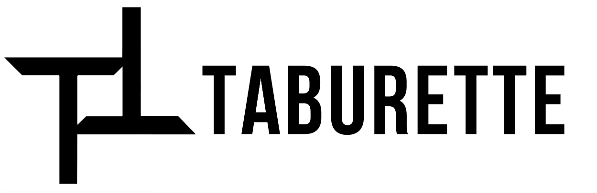

# Taburette

## ATTENTION

This project is discontinued. No more contributions expected.

## General

  " width="75%"/>

Tablature displaying application built with `Flask`/`SQLAlchemy` for backend and `React`
for frontend. Full list of planned features can be found in [PRD](docs/PRD.md).

## Tech stack

- `Flask`/`SQLAlchemy`/`unittest` for backend
- `React` for frontend
- `AWS` for hosting (WIP)
- `Travis CI` for CI/CD (WIP)

## Build instructions

We have two parts of the project, a rearguarde and vanguarde one. Please refer to
[how to's](docs/how-to-s.md) page for details.

## Contribution

Potential collaborators are encouraged to take part in the development/testing/any form of
improvement of the product. Please contact [@kostmetallist](https://github.com/kostmetallist) for
more information.

